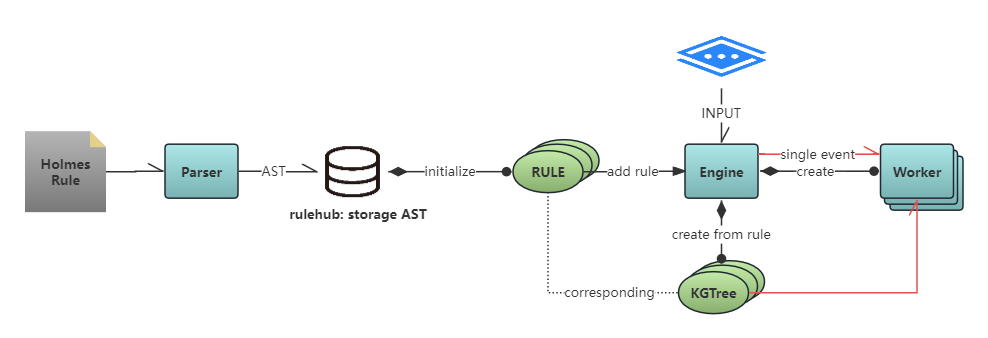

# 福尔摩斯: 流式跨事件查询引擎
[](https://github.com/Amber-Security/X-EQL/releases/tag/v1.1.2-alpha)
[](https://github.com/Amber-Security)
[](https://www.gnu.org/licenses/agpl-3.0)

## 功能

从流式的事件输入中查询符合数据特征约束的一个事件序列

## 快速上手

> 引擎整体被封装为两个python的包：engine和rule

### 规则开发

#### Holmes语法

```
RULE_NAME: MODE sequence by FIELD1, FIELD2, ...
    [EVENT_TAG1] by (f4, f5):g, (f1, f2):g1, (f3):g2
    [EVENT_TAG2] by (f1, f2):g, (f3):g2, (f5):g3
    [EVENT_TAG3] by (f2, f1):g, (f3, f4):g1, (f5):g3
```

* `RULE_NAME` - 规则名
* `MODE` - 值可选为 `sparse` or `dense`. 目前仅支持 `sparse`
* `by FIELD1, FIELD2, ...` - 全局字段约束，可以不指定
* `EVENT_TAG1` - 指定一个单事件的名字.
* `by (f4, f5):g` - 指定一组字段约束. 括号内指定这个group要约束该事件的哪些字段名.

#### 规则编译

```Python
from rule.parser import Parser

parser = Parser()
ast = parser.parse(rule="# content of the holmes rule")

parser.dump(ast, "rule_xxx.json")
```

#### 规则加载

```Python
import json
from holmes_rule.rule import load_rule

with open("rule_xxx.json", "r", encoding="utf-8") as file:
    ast = json.load(file)

rule = load_rule(ast)
```

### 引擎运行

#### 添加规则

```Python
# ...
# rule = load_rule(ast)

from engine.engine import Engine

engine = Engine()
engine.add_holmes_rule(rule=rule)
```

#### 事件输入

```Python
test_events_without_noise = [
    {"holmes-tag": "tag1", "pid": 111, "f1": "a", "f2": "b", "f3": "c", "f4": "d", "f5": "e", "time": 1},
    {"holmes-tag": "tag2", "pid": 111, "f1": "d", "f2": "e", "f3": "c", "f4": " ", "f5": "x", "time": 10},
    {"holmes-tag": "tag2", "pid": 111, "f1": "d", "f2": "e", "f3": "c", "f4": " ", "f5": "y", "time": 11},
    {"holmes-tag": "tag2", "pid": 111, "f1": "d", "f2": "e", "f3": "c", "f4": " ", "f5": "x", "time": 12},
    {"holmes-tag": "tag3", "pid": 111, "f1": "e", "f2": "d", "f3": "a", "f4": "b", "f5": "y", "time": 20},
    {"holmes-tag": "tag3", "pid": 111, "f1": "e", "f2": "d", "f3": "a", "f4": "b", "f5": "x", "time": 21},
    {"holmes-tag": "tag3", "pid": 111, "f1": "e", "f2": "d", "f3": "a", "f4": "b", "f5": "y", "time": 22},
]

for event in test_events_without_noise:
    engine.process_event(event=event)
```

#### 结果读取

```Python
engine.fetch_results()
```

## 开发者手册

### 各模块理解

#### src目录结构

```
·-+-· rule
  |    +-· syntax.py  → 规则的YACC文法实现
  |    +-· rule.py    → 规则的class定义，引擎是根据这里的实现来理解规则的；提供api将输入的ast实例化为规则实例
  |    +-· parser.py  → 输入文本规则，调用syntax中的接口解析规则，输出为规则的ast
  +-- engine
       +-· engine.py  → 处理引擎，提供添加规则、输入事件、读取结果3个api
       +-· worker.py  → 一条规则一个worker，由worker承担全部的匹配计算
       +-· kgtree.py  → kgtree维护规则匹配的全部状态
       +-· event.py   → 输入单事件的数据抽象
```

#### 各模块工作流



### 算法理解

#### 数据结构

- Event
  - 增量查验表：<gid → fields>，含义见Worker
  - 增量查验表 - 口令表：是增量查验表的填值实例
- KGTreeNode
- Engine
  - 添加及初始化holmes规则
  - 输入event处理
    - 先判断这个event都有哪些适用的worker（rule）
    - 送入worker处理
    - 处理完后prune清理状态
  - 获取规则
- Worker
  - 一个holmes规则实例化一个worker
    - 静态结构
      - 记录起始、终止事件的tid
      - 记录事件序列的tid seq、set
      - 做事件位序表：tid → 位序，可以查看每个事件的位序
      - 做事件约束表kg：tid → <gid → fields>，可以查看每个事件的所有约束字段
      - 做增量查验表inc：tid → <gid → fields>，可以查看每个事件哨卡仅非免检的约束字段（非这些字段组已经是免检的了，因为前面已经查验过了）
      - 做哨卡查验表conj：tid → <tid → []gid>，代入一个待检event视角，它通过层层哨卡时，[仅]需要同该哨卡查验哪些暗号
    - 动态状态
      - EID_MAP：事件uuid → 事件数据结构的映射
      - ENTRY_POOL：是个森林，存一堆entrynode
  - 一个worker负责维护该rule的全量处理状态
  - sparse模式
    - 先判断是否是起点event，是的话创建一个新的entry node，然后返回，不再做进一步处理
      - 创建新entry node时：
        - 先创建一个event：uuid唯一标识，重点是填入了增量查验表的实值口令
        - 填动态状态中的EID_MAP，实例化一个treenode返回
      - 为treenode设置时间戳
      - 为treenode设置leaf是自身：没看懂
    - 如果事件压根都不在这个规则的tid set里直接pass：实际上做重复了，外层已经约束过了
    - 开始过每棵检测森林：
      - dfs一棵tree，以dfs的方式遍历逐个哨卡，在所有通关的分支上加上自己
        - 遍历到叶子后：
          - 实例化这个事件的node结点，处理加边
          - 更新root的叶子们
          - worker的最晚时戳更新
          - 如果已经是终止结点，则返回结果
      - dfs返回的结果（每个都是一个完整命中事件）收拢
      - 如果last ts cache不为空，说明这个事件通过了至少一个哨卡分支，此时更新树的last ts并清空last ts cache
      - 返回result给engine
  - prune算法：
    - 先找出森林中所有的死叶子：完整匹配的 + span过期的
    - 开始剪枝

#### 碎碎念

1. 重复tid的规则？不支持？
2. 过哨卡时好像忘了查时戳？sparse模式下，大概率时戳是对的，这样节省性能，由于层层把关，只看最后一个保证对