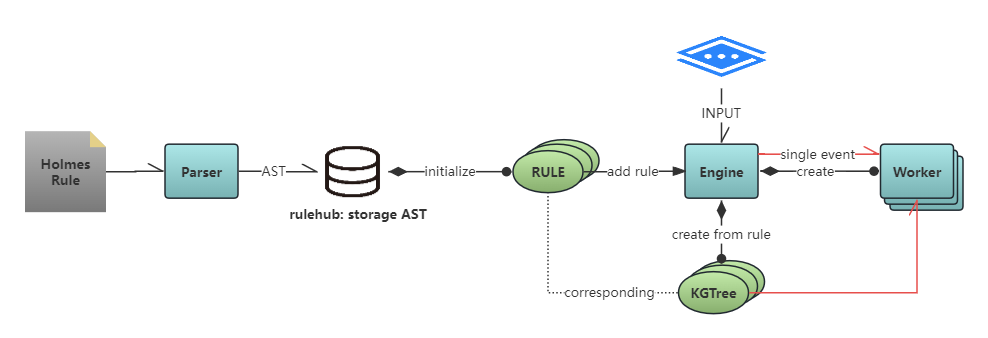

# X-EQL: Cross Events Query Language
[](https://www.gnu.org/licenses/agpl-3.0)
[](https://github.com/Amber-Security)

[📖 **·** X-EQL Chinese Doduments](./README.zh-cn.md)

## What is X-EQL

X-EQL is a streaming events query engine, which queries an event sequence from the streamed event input that fits the constraint of the data feature.

## Usage

> The whole engine is packaged into two python-package: `engine` and `rule`.

### Rule development

#### XEQL syntax

> TBD

#### Rule compile

```Python
from rule.parser import Parser

parser = Parser()
ast = parser.parse(rule="# content of the x-eql rule")

parser.dump(ast, "rule_xxx.json")
```

#### Rule load

```Python
import json
from rule.rule import load_rule

with open("rule_xxx.json", "r", encoding="utf-8") as file:
    ast = json.load(file)

rule = load_rule(ast)
```

### Engine running

#### Add rules

```Python
# ...
# rule = load_rule(ast)

from engine.engine import Engine

engine = Engine()
engine.add_eql_rule(rule=rule)
```

#### Feed events

```Python
test_events_without_noise = [
    {"x-eql-tag": "tag1", "pid": 111, "f1": "a", "f2": "b", "f3": "c", "f4": "d", "f5": "e", "time": 1},
    {"x-eql-tag": "tag2", "pid": 111, "f1": "d", "f2": "e", "f3": "c", "f4": " ", "f5": "x", "time": 10},
    {"x-eql-tag": "tag2", "pid": 111, "f1": "d", "f2": "e", "f3": "c", "f4": " ", "f5": "y", "time": 11},
    {"x-eql-tag": "tag2", "pid": 111, "f1": "d", "f2": "e", "f3": "c", "f4": " ", "f5": "x", "time": 12},
    {"x-eql-tag": "tag3", "pid": 111, "f1": "e", "f2": "d", "f3": "a", "f4": "b", "f5": "y", "time": 20},
    {"x-eql-tag": "tag3", "pid": 111, "f1": "e", "f2": "d", "f3": "a", "f4": "b", "f5": "x", "time": 21},
    {"x-eql-tag": "tag3", "pid": 111, "f1": "e", "f2": "d", "f3": "a", "f4": "b", "f5": "y", "time": 22},
]

for event in test_events_without_noise:
    engine.process_event(event=event)
```

#### Fetch results

```Python
engine.fetch_results()
```

## For developer

### Understand each module

#### src directory

```
·-+-· rule
  |    +-· syntax.py  → YACC grammar implementation of rules
  |    +-· rule.py    → The class definition of the rule, based on which the engine understands rules; Provides an api transforming the input AST to a rule instance.
  |    +-· parser.py  → Input the x-eql rule text, invoke the parsing-api in `syntax.py`, and return the ast of the rules
  +-- engine
       +-· engine.py  → The processing engine. Three apis provided: add rule, input events and fetch results.
       +-· worker.py  → Each rule has one worker. The worker undertakes all computing.
       +-· kgtree.py  → A kgtree maintains all state of one rule's matching
       +-· event.py   → Data abstraction of a single input event.
```

#### Workflow by modules



### Algorithm

> to be translated.
